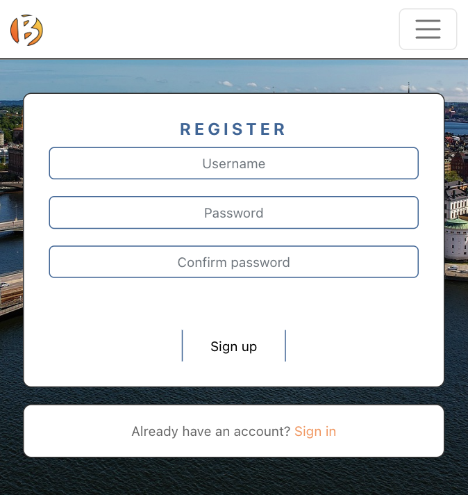
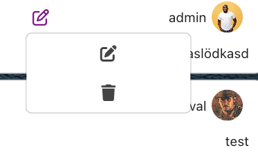

[X] [What is it](#what-is-bokning)
[X] [User Stories](#user-stories)
[X] [UI & UX](#UI-&-UX)
[X] [Features and pages](#features-and-pages)
[X] [React](#react)
[X] [Showing Booking from db](#showing-bokoing-from-database)
[X] [Adding Booking to db](#adding-booking)
[X] [Updating Booking in db](#update-booking)
[X] [Deleting Booking from db](#remove-booking)
[X] [Testing](#testing)
[X] [Deployment](#deployment)
[X] [Tech](#technologies) 
[X] [Support](#support)
[] [Bugs](#bugs-and-missing-features)

# What is Bokning?

The word *Bokning* is Swedish for 'booking'. It's sole purpose is a booking system to book an apartment by date, using ReactJS on the front end, connecting to a Django Restful API on the backend.
This project is the front end part of a full stack project for my 5th and last project in my Code Institute Full Stack Program. 

# User stories

## Navigation & Authentication

- Navigation: As a user I can view a navbar from every page so that I can navigate easily between pages
- Routing: As a user I can navigate through pages quickly so that I can view content seamlessly without page refresh
- Authentication - Sign up: As a user I can create a new account so that I can access all the features for signed up users
- Authentication - Sign in: As a user I can sign in to the app so that I can access functionality for logged in users
- Authentication - Logged in Status: As a user I can tell if I am logged in or not so that I can log in if I need to
- Authentication - Refreshing access tokens: As a user I can maintain my logged-in status until I choose to log out so that my user experience is not compromised
- Navigation: Conditional rendering - As a logged out user I can see sign in and sign up options so that I can sign in/sign up

## Adding, deleting and editing Bookings
- Create booking: As a logged in user I can book the apartment so others can see that it is booked
- Delete booking: As a logged in user I can delete a booking so others can see that it is vacant
- Edit booking: As a logged in user I can edit the booking if I need to change the date or description

## The Bookings List Page
- View bookings: As a user I can view all the current bookings of the apartment, ordered by date of booking, increasing so that I can se what is available
- As a user, I can search for a booking y choosing a specific date with a date picker, so that I can quickly find the date I am looking for
- As a user, I can edit/delete a booking by using the drop down menu on my bookings. 

## The DM Page 
- Create a direct message: As a logged in user I can send direct messages to the other users
- Delete a direct message: As a logged in user I can delete direct messages to other users

## The Profile Page
- Profile page: As a user I can view other users profiles so that I can see their posts and learn more about them
- Edit profile: As a logged in user I can edit my profile so that I can change my profile picture and bio
- Update username and password: As a logged in user I can update my username and password so that I can change my display name and keep my profile secure

# UI & UX

## Wireframe

The design has followed basic simple principles regarding conrast, font sizes, color contrast and fonts to keep the page simple but appealing. 

The background is an aerial picture of stockholm, since the apartment is located there.
On both the login and register page there are a small image to the right (on larger than mobile devices) to give a mental connection to what it is the page is about. 

Sign in- page: A rendered image of a bed in a large room with the sun shining in through the window
Sign up- page: A picture of the sky scrapers stretching up into the clear sky

# Features and Pages

## Navbar
Desktop

Mobile device

## Sign Up
Sign up page for the booking

## Sign In
Sign in page for the booking

## Book 
This is where you book a specific date.
Note* When no date / booked date is chosen in the date picker, the comment and book button are disabled.
When a non booked date is picked, the comment and book button is enabled. 

## Calendar
Shows a list of all the current bookings
Allows you to edit/delete your bookings

### Booking Component
This is a reusable component used by the React framework to dynamically display a list of bookings.
Each booking is displayed using the same component, but inseriting the respective information into that component

## Profile
Allows you to view and change your profile information including username and password

## Sign Out
Signs you out from the webpage

## Adding Booking
Adds a booking to the database via the backend Restful API

## Update Booking
Updates a booking in the database via the backend Restful API

## Remove Booking
Removes a booking from the database via the backend Restful API

# React

This project makes use of the Javascript framework React, v17.
React is a framework that makes use of reusable components, custom syntax to more easily write quick code and rerendering components without refreshing the page, giving the user a 'seamless' experience when browsing. 

From a users point of view, React makes websites seem quick and sometimes without the need to refresh, which gives a quick and immersive feel of the page. 
Responsive design is also easily done with react, so the development of mobile friendly sites is easy.
React is also great for mobile development

## Page switch

The most prominent way to see this 'seamless'/refreshless transition between pages is when using the menu and klicking the different links; the pages are loaded instantly without refreshing the page or menu. 

## Reusable Compontents

Bokning makes use of reusable components when loading the list of booked dates. 
When the list has loaded, the page iterates through the list and displays a component for each booked day.
The component 'BookingDetail' is rendered once for each booked day in the list, but with the correct corresponding information from each list item.

# Testing

Manual testing has been done with the following steps: 

- Sign up using too short password
    - Expected result: Error message saying password is too short
    - Actual result: Error message saying password is too short
- Sign up using too short password
    - Expected result: Error message saying "This password is too short. It must contain at least 8 characters."
    - Actual result: Error message saying "This password is too short. It must contain at least 8 characters."
- Sign up using no password
    - Expected result: Error message saying "This field may not be blank"
    - Actual result: Error message saying "This field may not be blank"
- Sign up using an existing username
    - Expected result: Error message saying "A user with that username already exists."
    - Actual result: Error message saying "A user with that username already exists."
- Sign up using emmpty username
    - Expected result: Error message saying "This field may no tbe blank."
    - Actual result: Error message saying "This field may no tbe blank."

- Sign in using incorrect credentials
    - Expected result: Error message saying "Unable to log in with provided credentials."
    - Actual result: Error message saying "Unable to log in with provided credentials."
- Sign in using correct credentials
    - Expected result: Redirect to calendar page 
    - Actual result: Redirect to calendar page 

- Book a date without choosing date in date picker
    - Expected result: Not possible due to book button being disabled until the selected date is valid/not booked
    - Actual result: Book button is disabled until a valid date is selected.

- Delete a booking if you are the user
    -  Expected result: Booking should be deleted from list
    -  Actual result: Booking is deleted from list

- Login as different users and check if the drop down changes based on ownership
    - Expected result: only posts made by the logged in user are able to be edited or deleted
    - Actual result: only posts made by the logged in user are able to be edited or deleted

- Edit a booking
    - Expected result: user is redirected to an edit page for the post
    - Actual result: user is redirected to an edit page for the post

- Change username
    -  Expected result: user can change their username
    -  Actual result if username is not blank: username is changed, unless the username is blank
    - Actual result If username is left blank: there is an error message saying "This field may not be blank."
    - Changing username to an existing one
        -  Expected result: error message saying "A user with that username already exists."
        -  Actual result: error message saying: "A user with that username already exists."

- Change password
    - Same process as when signing up as a new user

# Deployment
 
## Loacl run `npm run build`

Builds the app for production to the `build` folder.\
It correctly bundles React in production mode and optimizes the build for the best performance.

The build is minified and the filenames include the hashes.\
Your app is ready to be deployed!

## Git Upload

Github is used as Git version control and Agile project planning/,management. 
Using VS Code, the project is coded locally, and then on Commit, uploaded to the github reposirtory.

The project is then hosted on Heroku by the following instructions:

- Sign up / Log in to your Heroku account
- Top right corner -> Create new app
- Choose app name and region and click create app
- Deploy -> Connect to your github repository by searching in the search field.
    - When the repository shows up in the list, click it and then click 'Connect'

# Tech

- HTML
- CSS, React-Bootstrap
- Javascript / React
- VSCode
- Heroku
- GitHub
- Google chrome

# Support

The project was coded using Code Institutes 'Moments' as a base for learning. 

# Bugs and Missing features

The following is not completed: 

Feature: DM / messaging function between members
Bug: editing a post crashes
Auth: Sign in on Safari doesn't store token
Date check: Coming feature - check if todays date is newer than chosen date in date picker